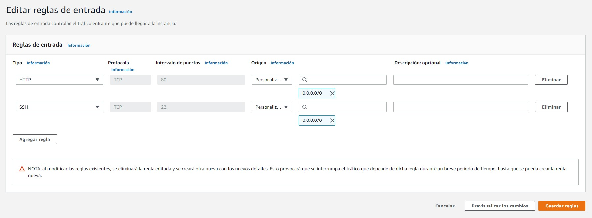
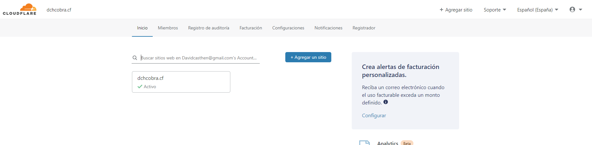

# SERVIDORES

## COMO HACER UN "SUBDOMINIO" (**es**.dominio.es)

Primero de todo tenemos que abrir el puerto 80 en nuestro servidor 

Si el servidor esta alojado en AWS vamos a seguridad --> grupos de seguridad y editamos las reglas de seguridad y abrimos nuestro puerto 80


---

Una vez que tenemos el puerto 80 abierto tenemos que asignar a nuestra maquina un DNS para poder acceder desde internet con un nombre (dchcobra.wk).

### ¿COMO CONSEGUIR UN DNS? (FREENOM)

Podemos conseguir un DNS desde distintos sitios de internet, para conseguirlo de manera segura y poder acceder a un dominio gratis vamos a https://www.freenom.com/es/index.html?lang=es .
Una vez que estamos en la pagina de Freenom y nos hemos registrado buscamos nuestro dominio y si esta disponible lo compramos durante el tiempo que queramos. 

Los dominios que acaban .tk, .ml, .cf, .ga y .gq son totalmente gratuitos hasta un periodo de 1 año.

### ¿COMO VINCULAMOS NUESTRO SERVIDOR AL DNS? (CLOUDFLARE)

Para vincular y configurar nuestro DNS vamos a acceder a https://www.cloudflare.com/dns y nos registraremos.

Una vez que nos hemos registrado correctamente apareceremos en el inicio y le daremos al botón de agregar un sitio.



Una vez que le damos a agregar un sitio y hemos introducido el nombre del dominio que hemos registrado en Freenom, le damos al panel que es gratis y seguimos poniendo y ponemos la IP con el nombre de dominio y ponemos que sea HTTP.

---

### CONFIGURACION DE FICHEROS

Una vez que tenemos lo anterior vamos a nuestra maquina y hacemos:

1. Nos movemos a la carpeta donde aparecen las webs disponibles:

   ```bash
   cd /etc/apache2/sites.available
   ```

2. Copiamos el fichero predeterminado y le ponemos el nombre que nosotros queramos segun el DNS

   ```bash
   sudo cp 000-default.conf test.dchcobra.cf.conf
   ```

3. Modificamos el fichero que hemos copiado

   ```bash
   sudo nano test.dchcobra.cf.conf
   ```


4. Habilitamos el fichero para que puedan acceder y reiniciamos el servicio de apache

   ```bash
   sudo a2ensite test.dchcobra.cf.conf
   sudo service apache2 reload
   ```

   

Aquí tenemos que configurarle ark.dchcobra.cf


